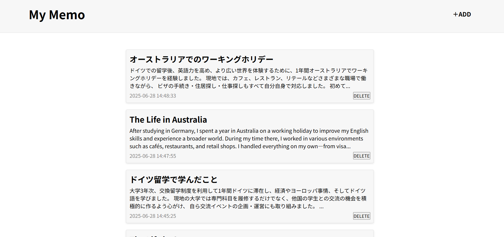
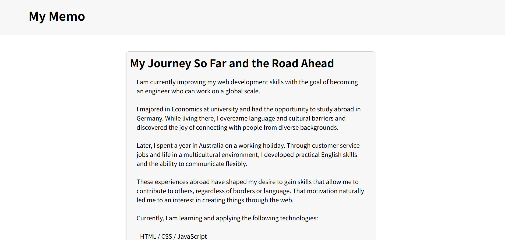

# My Memo App

## プロジェクト概要
PHP と MySQL を使って作成した、シンプルなメモ帳アプリです。  
メモの新規作成、一覧表示、詳細確認、削除などの基本機能を備えています。

## 使用技術
- PHP
- MySQL
- HTML / CSS

## 主な機能
- メモの新規作成
- メモの一覧表示
- メモの詳細ページ
- メモの削除

## 工夫したこと
- ファイルを一覧・作成・詳細の3ページに分けて、処理を分担しました。
- 入力値に応じて、`filter_input()`を使うことで、セキュリティ面を意識した作りにしました。
- 削除や編集の機能も見据えて、idをURLパラメータで管理する構造にしました。

## 学んだこと
- PHPでのフォーム処理や、MySQLを使ったデータの保存・取得を一通り学びました。
- `prepare`や`bindParam`を使うことで、安全にSQLを実行する方法を理解しました。

## デザイン

### トップページ

### メモ詳細ページ

## 連絡先

以下から気軽にご連絡ください：
- E-mail: [whoisyuma.0913@gmail.com](whoisyuma.0913@gmail.com)

## 備考
このアプリは学習用として作成しました。

# My Memo App

## Project Overview

This is a simple memo application built using **PHP and MySQL**.  
It includes basic features such as creating, listing, viewing, and deleting memos.

## Technologies Used

- PHP  
- MySQL  
- HTML / CSS

## Main Features

- Create a new memo  
- Display a list of memos  
- View memo details  
- Delete a memo

## Key Considerations

- The app is divided into three main pages: list, create, and detail, each handling a specific function.  
- Input values are handled using `filter_input()` to improve security.  
- The app uses URL parameters with IDs to manage individual memos, anticipating future features like editing and deletion.

## What I Learned

- Learned the basics of handling forms with PHP and storing/retrieving data using MySQL.  
- Gained an understanding of how to safely execute SQL using `prepare` and `bindParam`.

## Design

### Top Page (Memo List)

### Memo Detail Page

## Contact

Feel free to reach out:  
- E-mail: [whoisyuma.0913@gmail.com](mailto:whoisyuma.0913@gmail.com)

## Notes

This app was created for learning purposes.